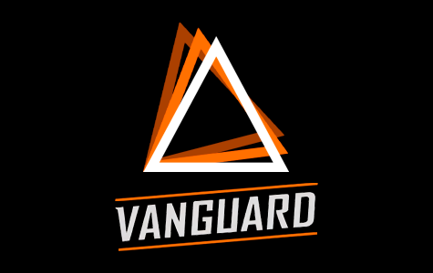

  

  
  
  
  
  

  
  
  

---

## 🚀 О проекте 

**Space Station 14** — это захватывающая ролевая игра, вдохновлённая культовой Space Station 13. 
Погрузитесь в атмосферу космической станции, где каждое ваше действие может привести к неожиданным последствиям. 
Наш проект предлагает:

- Уникальный геймплей, поддерживаемый целым рядом сообществ.
- Интенсивное взаимодействие игроков в замкнутом пространстве станции.
- Постоянное развитие благодаря движку [Robust Toolbox](https://github.com/space-wizards/RobustToolbox), написанный на C#.

---

  <b>✨ Активность проекта</b>

  <i>Следите за динамикой проекта и вовлечённостью сообщества:</i>

---

## 🌐 Участники проекта

Этот проект невозможен без усилий нашего сообщества. Вот те, кто внёс наибольший вклад:

---

## Лицензия

Большинство ресурсов лицензированы по [CC-BY-SA 3.0](https://creativecommons.org/licenses/by-sa/3.0/), если не указано иное. У ресурсов есть собственная лицензия и информация об авторском праве в метаданных файла. [Пример](https://github.com/AdventureTimeSS14/space_station_ADT/blob/master/Resources/Textures/Objects/Tools/crowbar.rsi/meta.json).

Большинство ассетов лицензированы под [CC-BY-SA 3.0](https://creativecommons.org/licenses/by-sa/3.0/), если не указано иное. Ассеты имеют свою лицензию и авторские права в файле метаданных. [Пример](https://github.com/space-syndicate/space-station-14/blob/master/Resources/Textures/Objects/Tools/crowbar.rsi/meta.json).

Обратите внимание, что некоторые ассеты лицензированы на некоммерческой основе [CC-BY-NC-SA 3.0](https://creativecommons.org/licenses/by-nc-sa/3.0/) или аналогичной некоммерческой лицензией, и их необходимо удалить, если вы хотите использовать этот проект в коммерческих целях.
